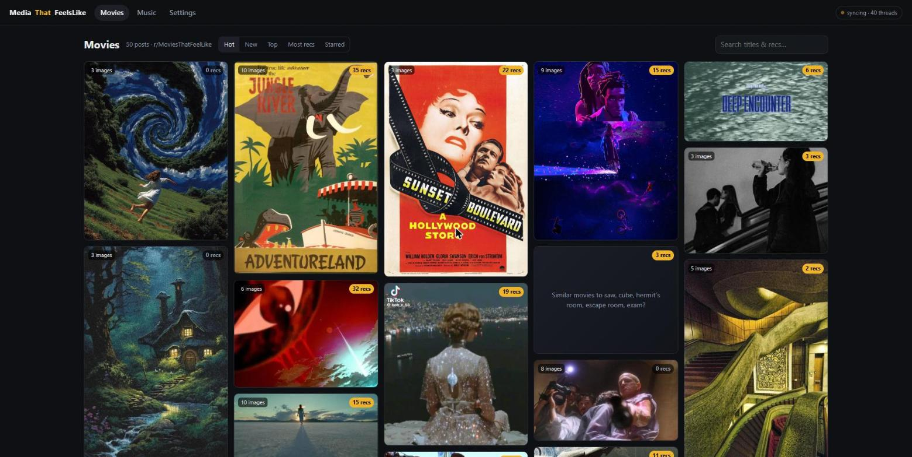
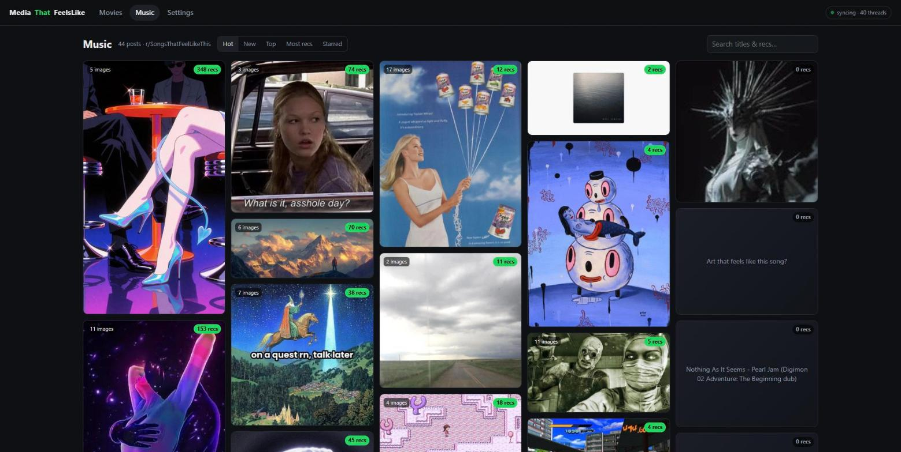
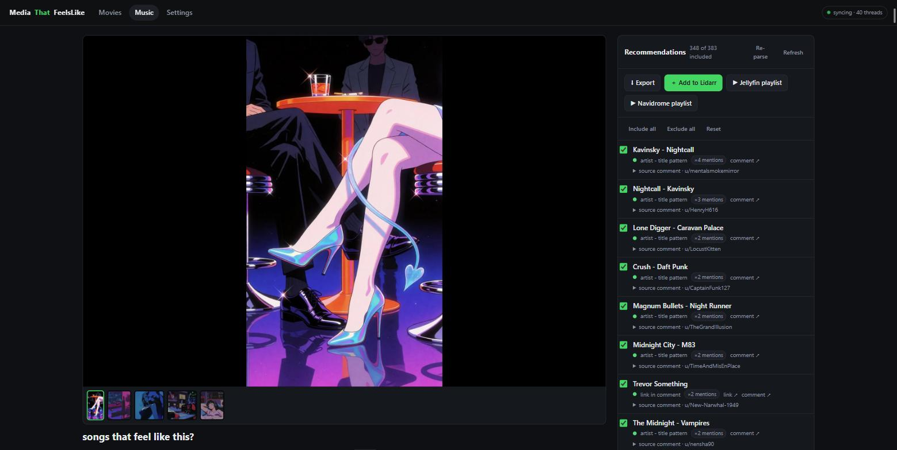
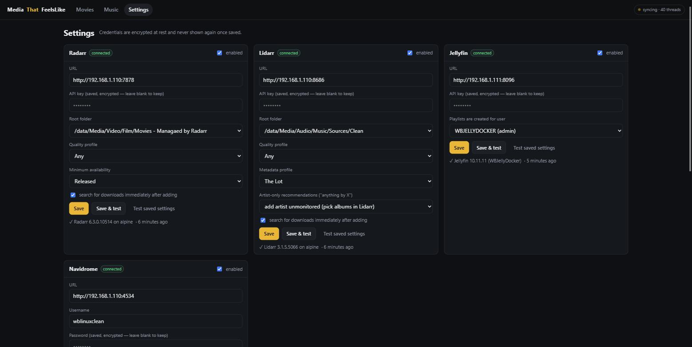

# MediaThatFeelsLike

A self-hosted web app that turns two "vibe recommendation" subreddits —
[r/MoviesThatFeelLike](https://reddit.com/r/MoviesThatFeelLike) and
[r/SongsThatFeelLikeThis](https://reddit.com/r/SongsThatFeelLikeThis) — into a browsable,
exportable discovery tool.

## The idea

Both subreddits work the same way: someone posts an image (or just a feeling) and asks
"what feels like this?", and the comments fill in with recommendations. That's a great
source of curated, vibe-matched discovery — but it's stuck in Reddit's UI, mixed in with
noise, and impossible to act on directly.

MediaThatFeelsLike pulls posts from both subs and presents them as two sections,
**Movies** and **Music**, each a mood-board grid of the post images — hover a tile with
more than one image and prev/next arrows let you flick through the gallery right there.
Clicking a tile opens the **vibe page**: the image(s) at the top, and a cleaned-up list
of recommendations parsed out of the comments — with the source comment one click away,
tick-boxes to curate the list, inline editing, and manual additions. Hover a recommendation
for a one-click **▶ Trailer** (movies) or **▶ Play** (music) button that opens a YouTube
search for it in a new tab — no setup, no API key, just a well-formed search query; YouTube's
own ranking reliably puts the actual trailer or song first. Music recommendations also get
a **Spotify** button alongside it, straight to a search on `open.spotify.com`.

From there:

- **Export** the list as CSV, plain text, or M3U/M3U8 (with real library paths when
  Navidrome or Jellyfin knows the item)
- **Add to Radarr** (movies) or **Lidarr** (music) — looked up, added, monitored and
  searched, with a per-item result line
- **Create a playlist** in **Jellyfin** or **Navidrome** from everything the library
  already has
- **Grab via slskd** (music) — searches Soulseek and queues the best matching file
  straight into your slskd downloads, a few tracks at a time

Radarr/Lidarr/Jellyfin/Navidrome/slskd are configured once on the Settings page;
credentials are encrypted at rest and never shown again.

## Screenshots

| | |
| --- | --- |
|  |  |
| Movies — mood-board tile grid | Music — same grid, music section |
|  |  |
| Vibe page: parsed recommendations, curation, export, integration buttons | Settings: Radarr/Lidarr/Jellyfin/Navidrome, connection-tested |

## How it gets the data

Reddit's official API is effectively closed to new personal apps (since Nov 2025), and
unauthenticated reddit.com JSON gets an IP blocked for hours once it notices you. So the
sync reads the **Arctic Shift** public Reddit archive by default — full posts including
galleries, full comment trees with real scores — and downloads images from Reddit's CDN
into a local cache so the grid never hotlinks. The other two backends (direct reddit.com,
PRAW) are still there behind `REDDIT_BACKEND`. `docs/ARCHITECTURE.md` has the evidence
trail and the pacing rules.

Recommendation parsing is heuristic (links, `Artist - Title`, `Title by Artist`,
`Title (Year)`, quoted titles, list items, short whole comments, title-case runs), each
candidate carrying a confidence score. Anything at 0.6+ is included by default; the rest
sits in a collapsed "low confidence" section to promote by hand. Curation is the point,
not an afterthought — the parser is a candidate generator.

## Running it

### Docker (the services LXC)

```sh
cp .env.example .env      # fill in DJANGO_SECRET_KEY, CREDENTIAL_ENCRYPTION_KEY,
                          # DJANGO_ALLOWED_HOSTS and (optionally) the service URLs/keys
docker compose up -d --build
```

The app is on port **8095**; the `sync` sidecar runs a sync every 30 minutes
(`SYNC_INTERVAL`, `SYNC_MAX_COMMENTS` in `compose.yaml`). Data (sqlite + cached images)
lives in `./data`. Press **Sync now** on the Settings page for the first fill, then let
the sidecar catch up over a few runs — comment threads are capped per run on purpose.

### Local development (Windows or Linux)

```sh
python -m venv .venv && .venv\Scripts\activate       # source .venv/bin/activate on Linux
pip install -r requirements-dev.txt
cp .env.example .env                                  # fill in as above
python manage.py migrate && python manage.py bootstrap
python manage.py sync_reddit --limit 20 --max-comments 12
python manage.py runserver
```

Then <http://127.0.0.1:8000/>. On Windows set `PYTHONIOENCODING=utf-8` first — the sync
log uses arrows. `pytest -q` runs the tests; `ruff check .` lints.

### Management commands

| command | what it does |
| --- | --- |
| `sync_reddit [--source SUB] [--kind movies\|music] [--limit N] [--max-comments N] [--refresh] [--no-images] [--force]` | fetch listings, comment threads, images; parse recommendations |
| `reparse_recommendations [--post ID] [--kind ...]` | re-run the parser over stored comments (no network) |
| `bootstrap` | create the two default sources, seed service settings from `.env` (idempotent) |

## Configuration

Everything is in `.env` (see `.env.example` for every key):

- `DJANGO_SECRET_KEY`, `DJANGO_DEBUG`, `DJANGO_ALLOWED_HOSTS` (comma-separated; must
  include the IP/hostname you browse to)
- `CREDENTIAL_ENCRYPTION_KEY` — Fernet key for the stored service credentials
- `REDDIT_BACKEND` (`auto` / `archive` / `direct` / `praw`), `ARCHIVE_USER_AGENT`,
  `REDDIT_FETCH_USER_AGENT`, optional `REDDIT_CLIENT_ID` / `SECRET`
- `RADARR_URL` / `RADARR_API_KEY`, `LIDARR_URL` / `LIDARR_API_KEY`, `JELLYFIN_URL` /
  `JELLYFIN_API_KEY`, `NAVIDROME_URL` / `NAVIDROME_USERNAME` / `NAVIDROME_PASSWORD`,
  `SLSKD_URL` / `SLSKD_API_KEY` — only used to seed the Settings page on first run; the
  Settings page is the source of truth afterwards
- `MEDIA_DATA_DIR` — where cached post images live. Leave unset for a `media`
  subfolder next to the sqlite DB. Images are by far the largest and fastest-growing
  thing this app stores, so point this at different (e.g. larger, network-attached)
  storage if that suits your setup better; in Docker, set `MEDIA_HOST_PATH` in `.env`
  instead (see `compose.yaml`'s comments) — that's the host-side path, bind-mounted
  into both containers, that this variable then points at from inside them
- `MIN_FREE_DISK_GB` (default 2.0) — image caching pauses (with a warning in the sync
  log) once free space under `MEDIA_DATA_DIR` (or wherever it defaults to) drops below
  this; everything else keeps working

Subreddits are managed on the Settings page too (add more sources to either section).
`--backfill N` (CLI or the Settings page's Sync form) pages further back into a
source's history — these subs turned out to be high-volume enough that even a
60-page backfill (100 posts/page) only reached a few months back for one and fully
exhausted six years of archive for the other, so "as far back as possible" ends up
bounded by disk space, not by how deep the archive actually goes. `MIN_FREE_DISK_GB`
and `MEDIA_DATA_DIR` above are the two knobs for that.

## Notes on the integrations

Every button — the bulk ones at the top of a vibe page and the "⊕" dropdown on each
individual recommendation row — is a direct, explicit API call triggered by that click.
None of this uses Radarr/Lidarr's own "Import List" feature (where Radarr/Lidarr itself
polls an external URL and auto-imports whatever's there): the point here is picking
specific recommendations out of a specific post, not following a blanket list.

The per-recommendation dropdown works independently of the row's include/exclude
checkbox (an explicit click is its own instruction) and independently of the bulk
buttons: for Radarr/Lidarr/slskd it's the same per-item action the bulk button already
does one at a time; for Jellyfin/Navidrome it adds to an *existing* playlist of the name
you give (creating it only if there isn't one yet) rather than always starting a new
one, so picking tracks one at a time naturally builds a single running collection —
leave the name prompt blank and it defaults to "MediaThatFeelsLike Picks".

- **Radarr**: lookup by title (+year when known), add monitored with the chosen root
  folder / quality profile, search immediately (toggle). Already-present films are
  reported, not duplicated. Either way the row's "radarr: added"/"radarr: exists" chip
  links straight to that film's own page in Radarr, opened in a new tab.
- **Lidarr** has no per-track concept, so a track is pushed as the album/single that
  carries it (album lookup by `Artist Title`, swapped order tried too); if none can be
  identified the artist is added unmonitored for hand-picking. Lidarr leaves a freshly
  added artist unmonitored after an album add and would skip it in RSS sync — the client
  waits for Lidarr's refresh and re-monitors it.
- **Jellyfin** / **Navidrome**: each recommendation is fuzzy-matched against the library;
  the ones found go into a new playlist, the rest are listed as "not in the library".
- **slskd**: searches Soulseek (waits up to a configurable timeout, default 15s, before
  cancelling the search early to collect whatever's arrived so far), picks the best
  audio file by title match + format/bitrate, weighted toward peers with a free upload
  slot and a short queue (a "better" file behind 100 people in line may never actually
  arrive). Downloads the winner automatically unless "auto-download" is turned off on
  the Settings page, in which case it just reports what it found. A push handles up to
  6 recommendations at a time by default (each search takes several seconds) — fewer if
  you raise the search timeout, so a batch can never outrun the server's request
  timeout. Press the button again to work through a longer list; anything already
  queued is skipped automatically. Soulseek is a P2P network, so results genuinely vary
  run to run — some tracks return hundreds of candidates in seconds, others none at all.

## Status

Deployed and running on the services LXC (`http://192.168.1.110:8095`), synced against
both subreddits and tested end-to-end against the real Radarr/Lidarr/Jellyfin/Navidrome
instances. Also on Docker Hub: [`wb20244/mediathatfeelslike`](https://hub.docker.com/r/wb20244/mediathatfeelslike).
There is no login — keep it on the LAN (like Glance/Homepage).

## License

[MIT](LICENSE).
